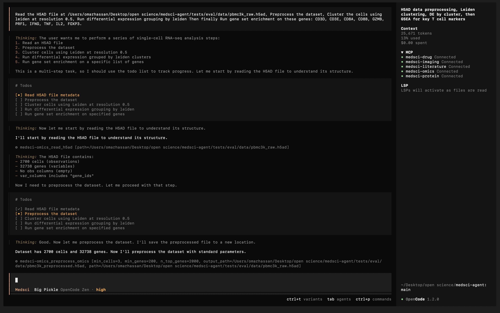
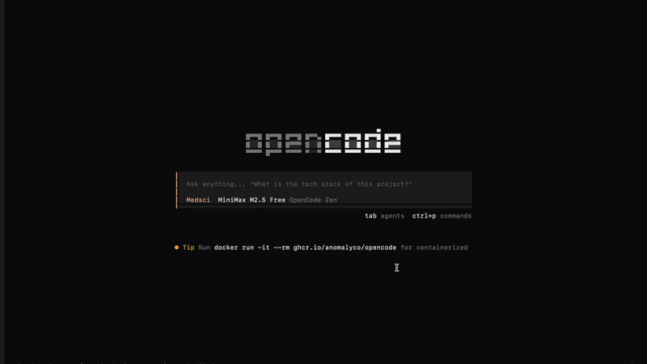

<p align="center">
  
</p>

<p align="center">The open source biomedical research agent.</p>

<p align="center">
  <a href="https://modelcontextprotocol.io"></a>
  <a href="https://huggingface.co/google/medgemma-4b-it"></a>
  <a href="https://huggingface.co/google/txgemma-2b-predict"></a>
  <a href="https://ollama.com"></a>
  <a href="https://opencode.ai"></a>
  <a href="https://bun.sh"></a>
  <a href="LICENSE"></a>
</p>

[](https://www.kaggle.com/competitions/med-gemma-impact-challenge)

MedSci Agent gives any LLM access to 26 biomedical and execution tools — drug ADMET prediction, protein structure search, single-cell RNA-seq analysis, medical image interpretation, literature search, and isolated sandbox execution — all powered by [MedGemma](https://huggingface.co/google/medgemma-4b-it), [TxGemma](https://huggingface.co/google/txgemma-2b-predict) running locally via Ollama, and [OpenCode](https://opencode.ai). No data leaves your machine.

Built for the [MedGemma Impact Challenge](https://www.kaggle.com/competitions/med-gemma-impact-challenge).

---

## Quick Start

Once [setup](#setup) is complete and Ollama is running, open the project in [OpenCode](https://opencode.ai) and try:

**Drug discovery:**
> Analyze the drug-likeness of ibuprofen (CC(C)Cc1ccc(cc1)C(C)C(=O)O) and predict its ADMET properties.


**Single-cell omics:**
> Read my H5AD file, preprocess it, cluster with Leiden at resolution 0.5, and run differential expression.


**Literature search:**
> Search PubMed for recent papers on CRISPR-Cas9 gene therapy for sickle cell disease.



The Agent automatically selects the right tools, calls MedGemma for interpretation, and returns a synthesized answer.

---

## Architecture

You bring your own LLM. Configure any model in OpenCode (via `/model`) and it becomes the orchestrator — it reads your query, selects the right tools, calls them through MCP, and synthesizes the results. The 6 MCP servers handle the domain logic underneath.

```
Cloud LLM (user's choice via OpenCode)
    |
    | tool calls via MCP
    v
+--- MCP Servers (Bun / TypeScript) ---+
|                                       |
|  server-drug        5 tools           |
|  server-protein     5 tools           |
|  server-literature  4 tools           |
|  server-imaging     1 tool            |
|  server-omics       5 tools           |
|  server-paperqa     1 tool            |
|  server-sandbox     5 tools           |
|                                       |
+-------+-------------------+-----------+
        |                   |
        v                   v
   Ollama (local)     Python Sidecar
   - MedGemma 4B      - RDKit
   - TxGemma 2B       - BioPython
                       - Scanpy
```

**MedGemma** interprets tool outputs — it reads raw data from APIs and computational tools, then provides clinically relevant summaries. Every tool that calls MedGemma returns a `model_used` flag and degrades gracefully if the model is unavailable.

**TxGemma** predicts ADMET properties (absorption, distribution, metabolism, excretion, toxicity). It runs exact prompt templates from the [Therapeutics Data Commons](https://tdcommons.ai) and outputs binary classifications for six safety endpoints.

The **Python sidecar** is a long-running process that pre-imports scientific libraries and handles requests over stdin/stdout via JSON-RPC. This avoids the 2–5 second startup cost of importing RDKit or Scanpy on every call.

---

## Tools

### Drug Discovery (server-drug)

| Tool | Description | Backend |
|------|-------------|---------|
| `analyze_molecule` | Physicochemical properties from SMILES (MW, LogP, TPSA, HBD/HBA, rings, formula) | RDKit + MedGemma |
| `lipinski_filter` | Lipinski Rule of Five drug-likeness check | RDKit |
| `molecular_similarity` | Tanimoto similarity between two molecules using Morgan fingerprints | RDKit |
| `predict_admet` | BBB penetration, intestinal absorption, hERG blocking, CYP3A4 inhibition, Ames mutagenicity, DILI risk | TxGemma + RDKit + MedGemma |
| `search_chembl` | Search ChEMBL for bioactive molecules and targets | ChEMBL API + MedGemma |

### Protein Analysis (server-protein)

| Tool | Description | Backend |
|------|-------------|---------|
| `parse_fasta` | Parse FASTA files, return sequence metadata | BioPython |
| `analyze_sequence` | Sequence length, composition, molecular weight | BioPython + MedGemma |
| `search_uniprot` | Search UniProt by gene, protein name, or accession | UniProt API + MedGemma |
| `search_pdb` | Search PDB for 3D structures by protein or PDB ID | RCSB PDB API + MedGemma |
| `predict_structure` | Retrieve AlphaFold predicted structure and confidence scores | AlphaFold DB API + MedGemma |

### Literature & Synthesis (server-literature & server-paperqa)

| Tool | Description | Backend |
|------|-------------|---------|
| `search_pubmed` | Search PubMed with Boolean and MeSH queries | NCBI E-utilities + MedGemma |
| `fetch_abstract` | Fetch full abstract and metadata by PMID | NCBI E-utilities + MedGemma |
| `search_openalex` | Search OpenAlex for scholarly works, citations, open access status | OpenAlex API + MedGemma |
| `search_clinical_trials` | Search ClinicalTrials.gov by condition, drug, or intervention | ClinicalTrials.gov API + MedGemma |
| `search_and_analyze` | Deep semantic synthesis of up to 10 papers (full text via NCBI BioC API, abstract fallback) using contextual LLM re-ranking | PaperQA2 + Tantivy |

### Medical Imaging (server-imaging)

| Tool | Description | Backend |
|------|-------------|---------|
| `analyze_medical_image` | Analyze X-ray, CT, pathology, or dermatology images (PNG/JPEG, max 50 MB) | MedGemma (multimodal) |

### Omics (server-omics)

| Tool | Description | Backend |
|------|-------------|---------|
| `read_h5ad` | Load H5AD file, return observation and variable metadata | Scanpy |
| `preprocess_omics` | Filter, normalize, log-transform, find highly variable genes | Scanpy |
| `cluster_cells` | Leiden or Louvain clustering with UMAP coordinates | Scanpy |
| `differential_expression` | Differential expression between groups (Wilcoxon, t-test, logreg) | Scanpy + MedGemma |
| `gene_set_enrichment` | Pathway enrichment against MSigDB, GO, KEGG via Enrichr | Enrichr API + MedGemma |

### Sandbox Execution (server-sandbox)

| Tool | Description | Backend |
|------|-------------|---------|
| `sandbox_prepare` | Create/reuse a Docker sandbox with default `network_policy=deny` | Docker Sandbox CLI |
| `sandbox_run_job` | Execute command in sandbox with deterministic timeout + logs | Docker Sandbox CLI |
| `sandbox_status` | Check sandbox state (`running`/`stopped`/`unknown`) with retry/backoff | Docker Sandbox CLI |
| `sandbox_fetch_artifact` | Read artifact/log content with size/path safety constraints | Host file access + safety checks |
| `sandbox_teardown` | Stop or remove sandbox | Docker Sandbox CLI |

---

## Setup

### Prerequisites

- [Bun](https://bun.sh) >= 1.1
- Python 3.10+ with a virtual environment
- [Ollama](https://ollama.com)
- [OpenCode](https://opencode.ai)
- Docker Desktop / Docker Engine
- Docker Sandbox CLI (`docker sandbox ...` commands available)

### 1. Clone and install

```bash
git clone https://github.com/omar-A-hassan/medsci-agent.git
cd medsci-agent
bun install
```

### 2. Python environments

The system uses two strictly decoupled Python virtual environments to prevent heavy machine-learning dependencies from bloating the core agent if you do not want to use deep literature synthesis.

**Core Environment (Required):**
```bash
python3 -m venv .venv
source .venv/bin/activate
pip install -r requirements.txt
```

**PaperQA Environment (Optional, for deep literature synthesis):**
```bash
cd packages/server-paperqa
python3 -m venv .venv-paperqa
source .venv-paperqa/bin/activate
pip install -r requirements.txt
cd ../..
```

> **Important:** Set `MEDSCI_PYTHON` to `.venv/bin/python3` in your `opencode.json` server environment blocks for core tools. The PaperQA server manages its own Python binary internally — it always uses `packages/server-paperqa/.venv-paperqa/bin/python3`.

### 3. Pull Ollama models

```bash
ollama pull medgemma:latest                                      # Biomedical interpretation
ollama pull mxbai-embed-large                                    # Document embeddings for PaperQA
ollama pull hf.co/matrixportalx/txgemma-2b-predict-GGUF:Q4_K_M  # ADMET prediction
```

If `medgemma:latest` is not available directly, pull the GGUF from HuggingFace and alias it:

```bash
ollama pull hf.co/unsloth/medgemma-4b-it-GGUF:Q4_K_M
cp ~/.ollama/models/manifests/hf.co/unsloth/medgemma-4b-it-GGUF/Q4_K_M \
   ~/.ollama/models/manifests/registry.ollama.ai/library/medgemma/latest
```

> **Note:** The `cp` command creates an alias so the code can reference the model as `medgemma:latest` regardless of how it was downloaded.

### 4. Configure OpenCode

The included `opencode.json` is pre-configured. Set the `model` field to your preferred cloud LLM:

```json
{
  "model": "openai/gpt-4o"
}
```

Update the `MEDSCI_PYTHON` path in each server's environment block if your virtual environment is in a different location.

### 5. Run tests

```bash
bun test
```

### 6. Start

Make sure Ollama is running, then open the project directory in OpenCode. The MCP servers start automatically.

---

## OpenCode Agent Usage

### Agent roles

- `medsci` is the primary orchestrator for cross-domain workflows.
- `drug`, `protein`, `omics`, and `imaging` are focused subagents for domain-deep tasks.
- All agents follow a planning-first contract (brief plan before first tool call, then strict sequential execution).

### Built-in project commands

This repo ships OpenCode slash commands under `.opencode/commands`:

- `/triage` — classify request and propose minimal sequential MCP plan
- `/lit-deep` — literature discovery + PaperQA deep synthesis workflow
- `/sandbox-job` — sandbox lifecycle run (`prepare → run_job → status(advisory) → fetch → teardown`)
- `/qc-check` — maker-checker quality gate on scientific outputs
- `/handoff-report` — compact handoff for next agent/human

### Sandbox command default

For inline script execution, prefer:

```bash
python3 -c "print('sandbox smoke ok')"
```

instead of `python -c ...` to avoid environment-path variability across sandbox templates.

### Determinism and status policy

- Treat `sandbox_run_job` success/failure as source-of-truth for execution outcome.
- Treat `sandbox_status` as advisory state signal.
- Backend applies status retry/backoff before returning `unknown`.

---

## Configuration

Environment variables (set in `opencode.json` under each server's `environment`):

| Variable | Default | Description |
|----------|---------|-------------|
| `MEDSCI_PROFILE` | `standard` | Hardware profile: `lite`, `standard`, or `full` |
| `MEDSCI_PYTHON` | `python3` | Path to Python binary (use `.venv/bin/python3` for the virtual environment) |
| `MEDSCI_OLLAMA_URL` | `http://127.0.0.1:11434` | Ollama API endpoint |
| `MEDSCI_OLLAMA_MODEL` | `medgemma:latest` | Default Ollama model for interpretation |
| `MEDSCI_OLLAMA_TIMEOUT` | `120000` | Ollama request timeout in milliseconds |
| `MEDSCI_PYTHON_TIMEOUT` | `60000` | Python sidecar request timeout in milliseconds |
| `PQA_LLM_MODEL` | `ollama/medgemma:latest` | LLM model PaperQA uses for summarization/answering (litellm format) |
| `PQA_EMBEDDING_MODEL` | `ollama/mxbai-embed-large` | Embedding model PaperQA uses for document indexing |
| `PQA_OLLAMA_URL` | `http://localhost:11434` | Ollama endpoint for PaperQA (separate from core) |
| `PQA_EMAIL` | `medsci-agent@localhost` | Email for NCBI API access (required by NCBI usage policy) |
| `PQA_USE_DOC_DETAILS` | `false` | If `true`, enables PaperQA metadata inference during indexing (less reliable with local models) |
| `PQA_CHUNK_CHARS` | `1200` | Default chunk size (characters) for PaperQA document reader before embedding |
| `PQA_CHUNK_OVERLAP` | `100` | Overlap (characters) between adjacent chunks |
| `PQA_CHUNK_MIN_CHARS` | `400` | Lower bound for automatic chunk-size backoff retries on embedding context errors |
| `PQA_CHUNK_BACKOFF_RETRIES` | `3` | Number of times to retry indexing with smaller chunks on embed context-limit errors |
| `PQA_ACQUIRE_CONCURRENCY` | `3` | Max concurrent NCBI acquisition requests in PaperQA |
| `PQA_MAX_TEXT_CHARS` | `1500000` | Hard cap on acquired paper text size (chars) to avoid indexing blowups |
| `PQA_NEGATIVE_CACHE_TTL_HOURS` | `24` | TTL for acquisition negative-cache entries (failed sources) |
| `PQA_LLM_TIMEOUT_SECONDS` | `180` | Timeout (seconds) for LLM and summary LLM requests via LiteLLM. Sidecar timeout auto-adjusts above this. |
| `PQA_ANSWER_MAX_SOURCES` | `5` | Maximum number of sources PaperQA includes in a synthesized answer |
| `PQA_EVIDENCE_K` | `10` | Number of evidence chunks PaperQA gathers before answering |
| `PQA_DOCSET_CACHE_MAX_ENTRIES` | `8` | Max number of in-memory docset cache entries per workspace |
| `PQA_DOCSET_CACHE_MAX_BYTES` | `209715200` | Max total bytes for in-memory docset cache (default 200 MB) |
| `PQA_SKIP_PREFLIGHT` | `false` | If `true`, skip Ollama model reachability/model-presence preflight checks |

Sandbox-related environment variables (optional, `server-sandbox`):

| Variable | Default | Description |
|----------|---------|-------------|
| `MEDSCI_SANDBOX_DEFAULT_TEMPLATE` | _unset_ | Optional default Docker sandbox template |
| `MEDSCI_SANDBOX_PULL_TEMPLATE` | `missing` | Template pull policy: `missing`, `always`, `never` |
| `MEDSCI_SANDBOX_ARTIFACT_ROOT` | `sandbox-artifacts` | Artifact root directory for run logs/metadata |
| `MEDSCI_SANDBOX_DEFAULT_TIMEOUT_SEC` | `600` | Default run timeout (seconds) |
| `MEDSCI_SANDBOX_MAX_TIMEOUT_SEC` | `3600` | Max allowed run timeout (seconds) |
| `MEDSCI_SANDBOX_STATUS_RETRY_ATTEMPTS` | `2` | Number of status retries before returning `unknown` |
| `MEDSCI_SANDBOX_STATUS_RETRY_BACKOFF_MS` | `1000` | Milliseconds between status retries |

### OpenCode policy hardening (included)

`opencode.json` includes baseline hardening:

- `edit`, `task`, `skill`, `webfetch`, `external_directory`, `doom_loop` default to `ask`
- `bash` allowlist for safe read-only/dev commands
- `bash` denylist for destructive actions (`rm *`, `git push*`)
- agent-specific task/skill permission scoping for `medsci`

### Plugin guardrails (included)

Project plugin: `.opencode/plugins/medsci-guardrails.ts`

- Blocks reading sensitive `.env` files via the `read` tool (allows `.env.example`)
- Logs tool telemetry (`tool`, `session_id`, `duration_ms`, `failed`) via `client.app.log`

The `MEDSCI_PROFILE` setting controls which Python libraries are pre-imported when the sidecar starts. All tools work regardless of profile — the sidecar imports libraries lazily on first use — but pre-importing avoids a cold-start delay on the first call.

| Profile | Pre-imported | Use case |
|---------|--------------|----------|
| `lite` | RDKit | Drug discovery tools only, lower memory usage |
| `standard` | RDKit, Scanpy, BioPython, leidenalg, igraph, pynndescent | Most workflows |
| `full` | All available | Fastest first-call latency across all tools |

### PaperQA Data Nuances
When querying papers via `server-paperqa`, the tool performs a multi-step pipeline:
1. **Text Acquisition** — Full-text articles are acquired via the NCBI BioC PMC API (DOIs, PMIDs, or PMCIDs). Papers not in PMC Open Access fall back to abstract-only via the BioC PubMed API. Acquired text is cached as `.txt` files in `.opencode/pqa_papers/`.
2. **Indexing** — PaperQA2 indexes the text files and builds a search index in `.opencode/pqa_index/`.
3. **RAG Synthesis** — The query runs against indexed chunks using Ollama for both summarization and final answer generation.

- **Models**: PaperQA uses `PQA_LLM_MODEL` (default: `ollama/medgemma:latest`) for summarization and answering, and `PQA_EMBEDDING_MODEL` (default: `ollama/mxbai-embed-large`) for document embeddings. Both run locally via Ollama.
- **Preflight**: The sidecar verifies Ollama reachability and required model presence before indexing/query. Failures return structured codes (`OLLAMA_UNREACHABLE`, `MODEL_NOT_FOUND`).
- **Agent Type**: Uses `"fake"` agent mode (deterministic search → gather evidence → answer path) rather than an LLM-driven agent, which reduces token usage.
- **Paper Limits**: The `search_and_analyze` schema strictly bounds processing to `max_papers=10` per call to avoid Out-of-Memory crashes.
- **PMC Open Access Coverage**: Full-text retrieval requires papers to be in the PMC Open Access subset (~3.5M articles). Papers outside this subset get abstract-only indexing — the response includes an `acquisition_summary` showing which papers were full-text vs abstract-only.
- **Stage-Gated Responses**: `search_and_analyze` now returns `stage_status` (`acquire`, `index`, `query`) and fail-soft terminal codes (`ACQUIRE_NONE_SUCCESS`, `INDEX_ZERO_SUCCESS`) instead of opaque failures.
- **Embedding Context Guardrail**: Indexing now uses conservative chunk defaults and automatic chunk-size backoff retries when Ollama embedding rejects large inputs (`/api/embed` context-limit errors).
- **Caching**: Paper acquisition uses canonicalized identifier hashing + manifests. Index/query path includes in-memory docset cache and persisted manifests under `.opencode/pqa_index/manifest.json`.
- **Stateful Indexes**: Do **not** manually delete `.opencode/pqa_index/` or `.opencode/pqa_papers/` while a PaperQA query is in progress.

---

## Project Structure

```
medsci-agent/
  packages/
    core/               Shared library (Ollama client, Python sidecar, config, types)
      python/
        sidecar.py      Long-running Python process with scientific library handlers
    server-drug/        Drug discovery MCP server
    server-protein/     Protein analysis MCP server
    server-literature/  Literature search MCP server
    server-imaging/     Medical imaging MCP server
    server-omics/       Single-cell and omics MCP server
    server-paperqa/     Deep literature synthesis MCP server (NCBI BioC text acquisition)
    server-sandbox/     Isolated sandbox execution MCP server
  .opencode/
    agents/             Agent definitions (orchestrator + 4 domain specialists + PaperQA routing)
    commands/           Reusable slash commands for MedSci workflows
    plugins/            OpenCode plugin guardrails and telemetry hooks
    skills/             Skill definitions for OpenCode
  opencode.json         OpenCode configuration (model, MCP servers)
```

---

## Runtime Artifacts

Sandbox runs generate runtime artifacts (for debugging and reproducibility), typically under `sandbox-artifacts/` or a configured artifact root:

- `job-*/stdout.log`
- `job-*/stderr.log`
- `job-*/metadata.json`

These are not source files and are safe to delete. Sandbox teardown removes containers; host-side artifacts remain unless explicitly pruned.

---

## Acknowledgments

This project builds on the following work:

- **Prompt Repetition** ([Leviathan, Kalman & Matias, 2025](https://arxiv.org/abs/2512.14982)) — Our `interpretWithMedGemma` function repeats the instruction after the data context to improve non-reasoning model accuracy.
- **TxGemma** ([Wang, Schmidgall, Jaeger et al., 2025](https://arxiv.org/abs/2504.06196)) — ADMET prediction uses verbatim prompt templates from Google's TxGemma, trained on [Therapeutics Data Commons](https://tdcommons.ai) benchmarks.
- **PaperQA2** ([Future-House/paper-qa](https://github.com/Future-House/paper-qa)) — Deep literature synthesis and RAG is powered by FutureHouse's PaperQA2 library, with text acquired via NCBI's BioC API.
- **K-Dense Scientific Skills** ([K-Dense-AI/claude-scientific-skills](https://github.com/K-Dense-AI/claude-scientific-skills)) — The OpenCode skills in this project are adapted from K-Dense AI's open-source collection of 147+ scientific skills for AI agents.

---

## License

[MIT](LICENSE)
